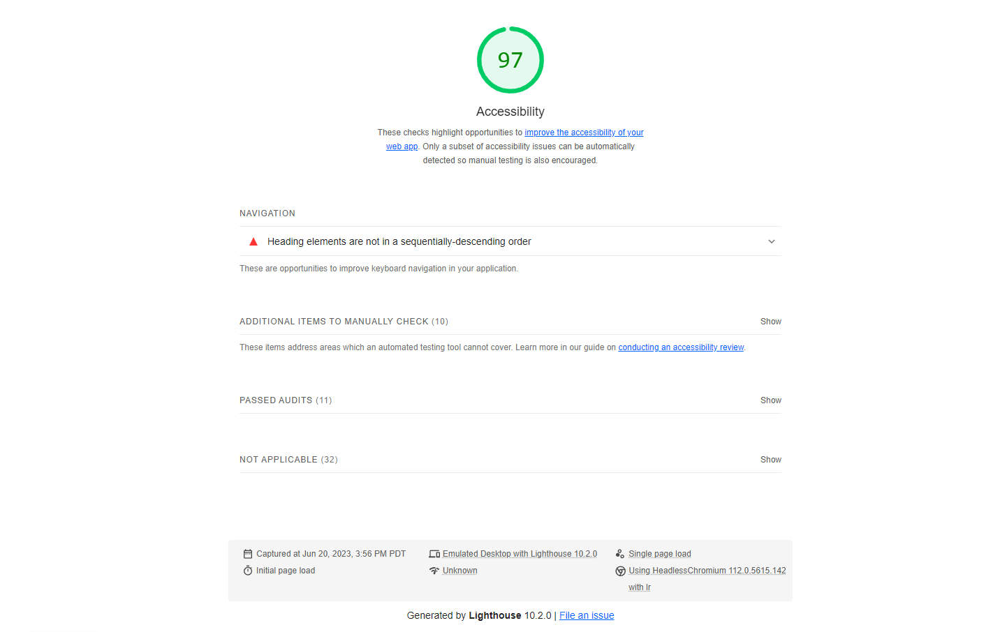

# LAB - 11

## Odd Duck Product Co

Build an app that displays three images, logs the amount of times each image is viewed and clicked on, then displaying a different set of images until you've completed the number of rounds. After that, you can click the "view results" button to display the results of those rounds. You can change the number of rounds, but they default to 25.

### Author: Geoff Lloyd

### Links and Resources

* [submission PR](https://github.com/gorfllord/odd-duck/pull/1)
* [live link](https://gorfllord.github.io/odd-duck)
* [logo duck pic](https://www.freepik.com/free-vector/cool-duck-summer-cartoon-vector-icon-illustration-animal-holiday-icon-concept-isolated-premium-vector-flat-cartoon-style_18305527.htm#query=funny%20duck&position=0&from_view=keyword&track=ais)

### Lighthouse Accessibility Report Score

* 

### Reflections and Comments

* Tripped over a few things, but mostly just simpler little flubs rather than wholesale logical fallicies. Otherwise it went pretty smoothly, despite it taking a number of hours to get everything finished.
